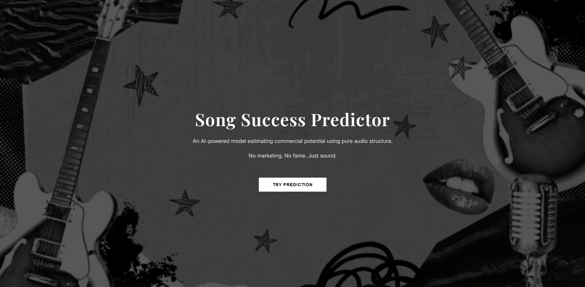

## 🎵 Music Popularity Predictor

A machine learning web application that estimates a song’s commercial popularity based purely on its audio features such as danceability, energy, tempo, loudness, and more.

The model was trained using a Random Forest Regressor and deployed using Flask to create an interactive web interface.

This project demonstrates:
- End-to-end ML workflow (data processing → training → evaluation → deployment)
- Feature scaling and model persistence
- Multi-page Flask routing
- Responsive UI design
- Real-time prediction rendering
---

## 🚀 Features
- Random Forest regression model
- Feature scaling with StandardScaler
- Flask backend
- Multi-page responsive UI
- Glassmorphism + editorial design
- Smooth scroll result display

---

## 🧠 Model Details
- Algorithm: RandomForestRegressor
- Evaluation:
  - R² Score: 0.54
  - MAE: ~10.7
- Trained on Spotify audio feature dataset

---

## ⚙️ Tech Stack
- Python
- Scikit-learn
- Flask
- HTML / CSS
- Jinja2

---

## ⚠️ Disclaimer
Prediction is based only on audio features.
Real-world success depends on marketing, fame, timing, and cultural impact.

---

## 📸 Screenshots

### Landing Page

### Prediction Page

---

## Live Demo
🔗 https://music-popularity-predictor-0xc5.onrender.com